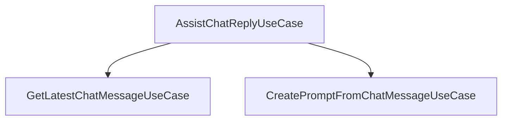

## AssistChatReply Flow

### Entry Point
- **A** → [AssistChatReplyUseCase](../src/application/usecases/assist_chat_reply_usecase.py)
- **B** → [GetLatestChatMessageUseCase](../src/application/usecases/get_lastest_chat_message_usecase.py)
- **C** → [CreatePromptFromChatMessageUseCase](../src/application/usecases/create_prompt_from_chat_message_usecase.py)

