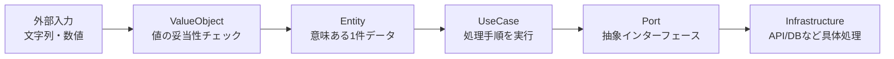
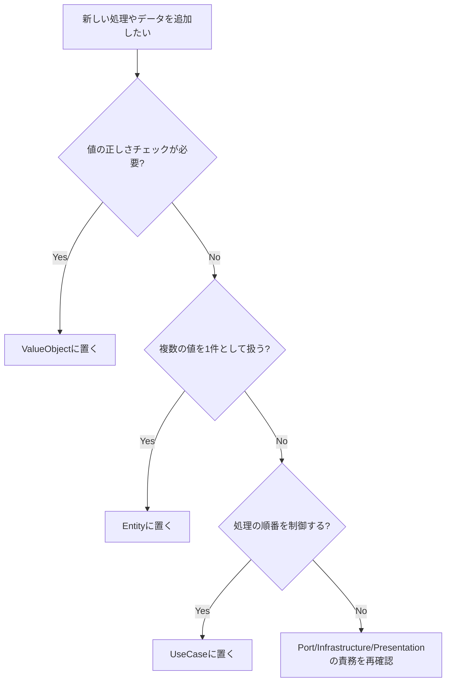

# Entity / ValueObject / UseCase かんたん整理メモ

このドキュメントは、Clean Architecture を学ぶときに迷いやすい  
`Entity` / `ValueObject` / `UseCase` の役割分担を、非エンジニアでも分かる言葉で整理したものです。

---

## 1. まず3つだけ覚える（最重要）

### ValueObject（値オブジェクト）
- 1つの値に「意味」と「ルール」を持たせる箱
- 例: `ChatMsgContent`, `ChatworkRoomId`, `PromptContent`
- 役割: 「この値は使ってよい値か？」をチェックする

### Entity（エンティティ）
- 複数の値をまとめて「1つの意味ある対象」にしたもの
- 例: `SendMessage`, `ChatworkReceivedMessage`, `Prompt`, `Response`
- 役割: 「業務で扱う1件のデータ」を表す

### UseCase（ユースケース）
- 処理の手順を並べる司令塔
- 例: `GetLatestChatMessageUseCase`, `AssistChatReplyUseCase`
- 役割: 「何をどの順で実行するか」を決める

---

## 2. レイヤの流れ（図）

ポイント:
- ValueObject が「不正値の侵入」を止める
- Entity が「業務上のまとまり」を表現する
- UseCase は「値の正しさ」そのものは判断しない（ValueObject に任せる）

---

## 3. このプロジェクトでの対応表

### ValueObject（値のルール）
- `src/domain/values/chat_msg_content.py`
- `src/domain/values/chatwork_room_id.py`
- `src/domain/values/prompt_content.py`
- `src/domain/values/llm_response_content.py`

### Entity（意味あるデータ）
- `src/domain/entities/chat/send_message.py`
- `src/domain/entities/chat/chatwork_received_message.py`
- `src/domain/entities/llm/prompt.py`
- `src/domain/entities/llm/response.py`

### UseCase（手順）
- `src/application/usecases/get_latest_chat_message_usecase.py`
- `src/application/usecases/create_prompt_from_chat_message_usecase.py`
- `src/application/usecases/request_llm_response_usecase.py`
- `src/application/usecases/assist_chat_reply_usecase.py`

---

## 4. 今回の修正から学べること

## ケース1: Domain Service に Entity をそのまま渡して失敗

対象:
- `src/domain/services/chat_llm_domain_service.py:22`

修正前:
- `PromptContent(content)` に `SendMessage` 全体を渡していた

問題:
- `PromptContent` は「文字列のみ」受け付ける ValueObject
- Entity 全体を入れると型不一致になる

修正後:
- `PromptContent(content.content.value)` に変更

学び:
- ValueObject には「必要な値だけ」を渡す
- Entity と ValueObject の責務を混ぜない

---

## ケース2: Fake UseCase の引数契約がテストと不一致

対象:
- `tests/application/fakes/assist_chat_reply_usecase.py`

何が起きたか:
- あるテストは `FakeRequestLlmResponseUseCase()` を引数なしで生成
- しかし Fake 実装は `generator` 必須だった

対応:
- `generator` を任意に変更
- 未指定時はダミー `Response` を返すようにした

学び:
- テストダブル（Fake）は「テストの目的」に合わせて柔軟に設計する
- 本番実装の厳密さと、テスト補助の使いやすさを分けて考える

---

## ケース3: テストファイル名の衝突で収集エラー

対象:
- `tests/infrastructure/chatgpt/test_chatgpt_adapter.py`
- `tests/infrastructure/chatwork/test_chatwork_adapter.py`

何が起きたか:
- 同名 `test_adapter.py` が別ディレクトリにあり、`pytest` 通常実行でモジュール衝突

対応:
- `tests/infrastructure/chatgpt/test_adapter.py` を
  `tests/infrastructure/chatgpt/test_chatgpt_adapter.py` に変更
- `tests/infrastructure/chatwork/test_adapter.py` を
  `tests/infrastructure/chatwork/test_chatwork_adapter.py` に変更

学び:
- テストは「実行できること」自体が品質
- ファイル名は衝突しないように一意化する

---

## 5. 迷ったときの判断フロー

---

## 6. 非エンジニア向け用語ミニ辞典

- `Port`: 「こう使いたい」という接続ルール（抽象）
- `Adapter`: Port の具体実装（外部APIと実際につなぐ）
- `DI（依存性注入）`: 使う部品を外から渡す方法
- `Invariant（不変条件）`: どんなときも守るべきルール
- `Fake`: テスト用の代役クラス

---

## 7. 実装前チェックリスト（短時間用）

- このロジックは「値の正しさ」か？  
  -> はい: ValueObject
- このロジックは「1件の意味あるデータ」か？  
  -> はい: Entity
- このロジックは「処理手順の制御」か？  
  -> はい: UseCase
- 外部APIの詳細を Domain に書いていないか？  
  -> 書いていたら設計崩れ

---

## 8. まとめ

- ValueObject: 値を守る
- Entity: 意味ある1件を表す
- UseCase: 流れを動かす

この3つを分離すると、設計が崩れにくくなり、テストもしやすくなります。

---

## 9. 関連ドキュメント

- Adapter / Port の図解は `docs/8_adapter_port_guide.md` を参照
