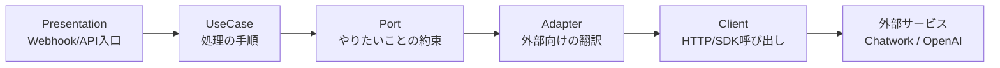
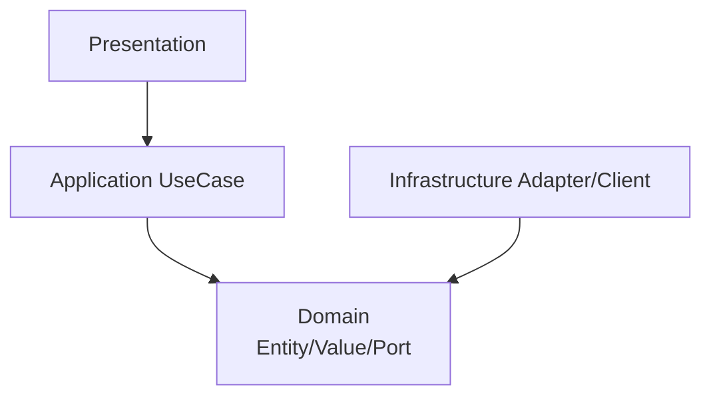
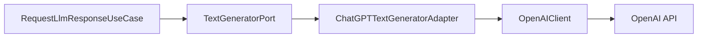
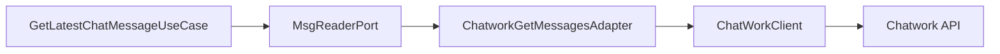
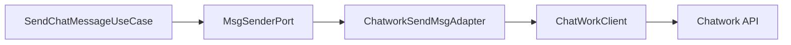

# Adapter / Port 超入門（非エンジニア向け）

このドキュメントは、Clean Architecture の `Adapter` が
「何のためにあるのか」を、できるだけ平易に説明するためのメモです。

---

## 1. 先に結論

- `UseCase` は「やりたいこと」を決める
- `Adapter` は「外部サービスとつなぐ方法」を担当する
- `Port` はその間の「約束（インターフェース）」を定義する

一言で言うと、`Adapter` は **翻訳係** です。

---

## 2. なぜ Adapter を作るのか

### 理由1: 外部サービスは変わるから
- API仕様変更
- 別サービスへの切り替え
- 認証方式の変更

これらの変更を `UseCase` に直接書くと、業務ロジックまで壊れます。
`Adapter` に閉じ込めれば、影響範囲を最小化できます。

### 理由2: テストしやすくするため
- `UseCase` は `Port` だけ知っていればよい
- テストでは `Fake` を差し込める

結果として、外部APIに接続しない高速テストができます。

### 理由3: 責務を分離するため
- `UseCase`: 処理手順
- `Domain`: データの意味・ルール
- `Adapter`: 外部との通信変換

役割が混ざらないので、読みやすく保守しやすくなります。

---

## 3. 図で理解する（全体フロー）

ポイント:
- `UseCase` は外部APIの細かい仕様を知らない
- 仕様差分は `Adapter` と `Client` 側で吸収する

---

## 4. 「依存方向」の図（重要）

意味:
- `UseCase` は `Port`（Domainの抽象）に依存
- `Adapter` は `Port` を実装
- これで `UseCase` は外部技術に引きずられない

---

## 5. このプロジェクトでの実例

### LLM返信

対応ファイル:
- `src/application/usecases/request_llm_response_usecase.py`
- `src/domain/ports/text_generator_port.py`
- `src/infrastructure/chatgpt/chatgpt_adapter.py`
- `src/infrastructure/chatgpt/client.py`

### Chatwork取得

対応ファイル:
- `src/application/usecases/get_latest_chat_message_usecase.py`
- `src/domain/ports/msg_reader_port.py`
- `src/infrastructure/chatwork/chatwork_adapter.py`
- `src/infrastructure/chatwork/client.py`

### Chatwork送信

対応ファイル:
- `src/application/usecases/send_chat_message_usecase.py`
- `src/domain/ports/msg_sender_port.py`
- `src/infrastructure/chatwork/chatwork_adapter.py`
- `src/infrastructure/chatwork/client.py`

---

## 6. Adapter がやってよいこと / ダメなこと

### やってよい
- API呼び出し用データへの変換
- APIレスポンスをDomain型へ戻す
- 通信エラーの変換

### やってはいけない
- 「返信するべきか」などの業務判断
- 優先度判断
- 画面表示ロジック

これらは `UseCase` / `Domain` の責務です。

---

## 7. よくある誤解

### 誤解: Adapter = UseCase と Entity を結合するもの

正しくは:
- `UseCase` と外部技術の **間を切り離す** ための層
- 結合するのではなく、むしろ **疎結合にする** ための仕組み

---

## 8. 5秒チェックリスト

- このコードは外部APIの仕様を知っているか？
  - Yes -> Adapter/Client
- このコードは処理手順を定義しているか？
  - Yes -> UseCase
- このコードは値の正しさを保証しているか？
  - Yes -> ValueObject

---

## 9. まとめ

- `Port` は「何をしたいか」の約束
- `Adapter` は「どうつなぐか」の実装
- `UseCase` は「どの順で実行するか」の司令塔

この分離により、外部変更が起きても業務ロジックを守れます。

---

## 10. 関連ドキュメント

- 社内決済を例にした説明: `docs/9_payment_port_adapter_example.md`
